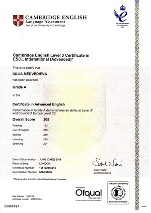
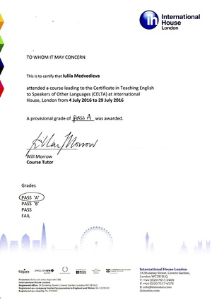
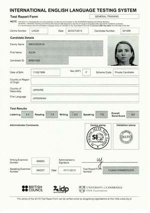
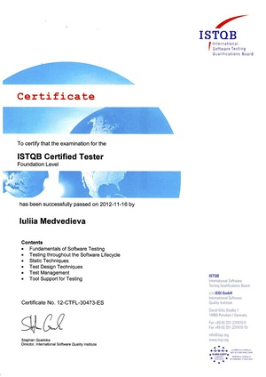

### Hear My Students

When working with a student, I always look into what is their goal: why they want to improve their English level? 
Answer to this question has a great impact on the learning path and techniques. 

I have asked a few of my former students to record a short video detailing their experience – please watch below. 

<a id="testimonial-gallery-show-all">Show all 4 video testimonials</a>

	
	
	
	

### Work Experience

Timeline should go here. Nevertheless: 

 * 2016-NOW [Addrian](google.com) English Courses
    * A few Intermediate and Pre-Intermediate Groups
    * Teacher Training seminars: ...
    * Teacher Training Seminars: ...
 * 2010- NOW Private Tutoring
 *  
 
### Education and Certifications

I believe that learning is a lifelong experience. 
 * IELTS preparation course from International House London
    * IELTS Teaching Speaking
    * IELTS Teaching Writing
    * IELTS Teaching Listening
 * International House London, CELTA
 * International House London, CAE
 * Kherson State University, MA in English Teacher (Hons.)
 * Kherson State University, BS in English Teacher (Hons.)
 
<a id="certificate-gallery-show-all">Show all 9 certificates</a>
 

 	
 	
 	
 	
 	
 	
 	
 	
 	
 

 
### Contacts
 
I prefer being contacted by email, but if you need something urgently, don't hesitate to give me a call. 

My contact details: 

* email: 
* phone: 
* website: 
* linkedIn: 
* facebook: 